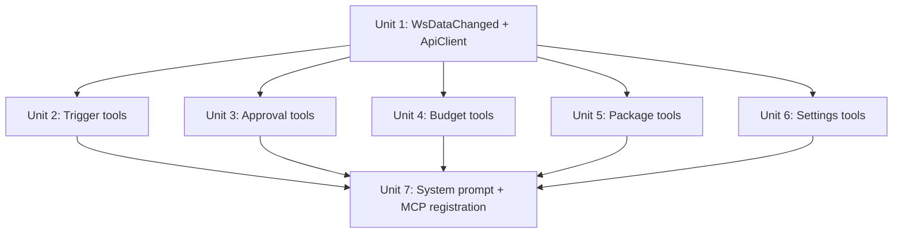

# feat: Add agent tools for triggers, approvals, budgets, packages, and settings

## Overview

Add 19 missing agent tools across 5 entity groups to bring action parity from 59% (27/46) to 100% (46/46) and CRUD completeness from 18% (2/11) to target. Tools must be added to **both** the in-app global agent (direct DB) and the standalone MCP server (HTTP API client).

## Problem Frame

The global agent can manage pipelines and skills but cannot touch 5 major entity groups that the UI and API already support: triggers, approvals, budgets, packages, and settings. This means operators cannot use natural language to schedule pipelines, approve/reject steps, manage cost controls, install packages, or change configuration.

## Requirements Trace

- R1. Trigger tools: `create_trigger`, `update_trigger`, `delete_trigger`, `list_triggers`
- R2. Approval tools: `list_approvals`, `approve_step`, `reject_step`
- R3. Budget tools: `list_budgets`, `create_budget`, `update_budget`, `delete_budget`
- R4. Package tools: `list_packages`, `install_package`, `update_package`, `uninstall_package`, `discover_packages`, `scan_package`
- R5. Settings tools: `list_settings`, `update_setting`
- R6. Each tool follows existing patterns in `server/src/services/tools/` (in-app) and `packages/mcp/src/tools/` (MCP)
- R7. Tools registered in respective index files
- R8. System prompt updated to describe new capabilities and sequencing rules

## Scope Boundaries

- No new API routes — all 5 entity groups already have full REST endpoints
- No UI changes
- No new DB schema changes
- Package tools: `install_package`, `update_package`, `uninstall_package`, `discover_packages`, `scan_package` only — export/publish/install-local are UI/CLI-only workflows, not agent-appropriate
- `WsDataChanged` entity union must be extended to include `"trigger"`, `"approval"`, `"budget"`, `"package"`, `"setting"` for broadcast support

## Context & Research

### Relevant Code and Patterns

**In-app tools** (`server/src/services/tools/`):
- Factory pattern: `make<ToolName>(ctx: AgentToolContext): ToolDefinition`
- Parameters: `Type.Object({...})` from `@mariozechner/pi-ai`
- Return: `{ content: [{ type: "text" as const, text: string }], details: {} }`
- Mutations call `ctx.broadcastDataChanged(entity, action, id)`
- Reference: `create-pipeline.ts`, `list-pipelines.ts`, `delete-pipeline.ts`

**MCP tools** (`packages/mcp/src/tools/`):
- Group registration: `register<Group>Tools(server: McpServer, client: ApiClient): void`
- Parameters: passed as a plain `{ key: z.type() }` record (third arg to `server.tool()`), not wrapped in `z.object()` — the SDK handles wrapping internally
- Error handling: try/catch with `{ isError: true }`
- Human-readable `format*()` helpers per entity group
- Reference: `pipeline-tools.ts`, `run-tools.ts`, `skill-tools.ts`

**API routes** (all under `/api`):
- Triggers: `GET/POST /pipelines/:pipelineId/triggers`, `PATCH/DELETE /triggers/:id`
- Approvals: `GET /approvals?status=`, `GET /approvals/:id`, `POST /approvals/:id/approve|reject`
- Budgets: `GET /budgets?scopeType&scopeId`, `POST /budgets`, `PATCH/DELETE /budgets/:id`
- Packages: `GET /packages`, `GET /packages/discover?q=`, `POST /packages/install|scan`, `POST /packages/:id/update`, `DELETE /packages/:id`
- Settings: `GET /settings`, `GET /settings/:key`, `PUT /settings/:key`

**Shared types**: `ApiTrigger`, `ApiApproval`, `ApiBudgetPolicy`, `ApiInstalledPackage`, `ApiSetting` all in `packages/shared/src/index.ts`

**DB tables**: `triggers`, `approvals`, `budgetPolicies`, `installedPackages`, `settings` all exported from `@pawn/db`

### Key Constraint: Approvals Require WsManager

The approvals route handler (`server/src/routes/approvals.ts`) uses `ws.broadcast()` directly to notify about run status changes after approve/reject. The in-app agent tools use `ctx.broadcast()` instead. The `approve_step` and `reject_step` in-app tools must replicate the run status update logic (re-queue on approve, fail on reject) and broadcast via `ctx.broadcast`.

## Key Technical Decisions

- **One file per tool for in-app, one file per group for MCP**: Matches existing convention. In-app tools are individual files; MCP tools are grouped by entity (e.g., `trigger-tools.ts`).
- **Extend `WsDataChanged` entity union**: Add `"trigger" | "approval" | "budget" | "package" | "setting"` to support real-time UI updates on mutations.
- **Package tools scope**: Only agent-appropriate operations (list, install, update, uninstall, discover, scan). Export/publish/install-local are interactive workflows that don't suit agent invocation.
- **Approve/reject tools duplicate run-status logic**: Rather than calling the HTTP route, in-app tools operate directly on DB (consistent with all other in-app tools) and replicate the approve→requeue / reject→fail logic.

## Open Questions

### Resolved During Planning

- **Should in-app tools call HTTP routes or DB directly?** DB directly — matches all existing in-app tools.
- **Should we add `check_updates` as a tool?** No — it's a background maintenance operation, not an agent action.

### Deferred to Implementation

- **Exact `broadcastDataChanged` call shape for approvals**: Approvals also change run status; the tool may need to broadcast both an approval change and a run status change. Determine at implementation time.

## Implementation Units

- [ ] **Unit 1: Extend shared types and MCP ApiClient**

**Goal:** Prepare the infrastructure both tool systems need — extend `WsDataChanged` entity union and add all missing `ApiClient` methods.

**Requirements:** R1–R5 (prerequisite for all)

**Dependencies:** None

**Files:**
- Modify: `packages/shared/src/index.ts`
- Modify: `packages/mcp/src/api-client.ts`
- Modify: `server/src/services/tools/context.ts`

**Approach:**
- Add `"trigger" | "approval" | "budget" | "package" | "setting"` to `WsDataChanged["entity"]` union
- Widen `AgentToolContext.broadcast` type to include `WsRunStatusChange` (needed by approval tools to broadcast run status changes after approve/reject, matching the route handler behavior)
- Add typed methods to `ApiClient` for each endpoint: `listTriggers(pipelineId)`, `createTrigger(pipelineId, data)`, `updateTrigger(id, data)`, `deleteTrigger(id)`, `listApprovals(status?)`, `approveStep(id, note?)`, `rejectStep(id, note?)`, `listBudgets(scopeType?, scopeId?)`, `createBudget(data)`, `updateBudget(id, data)`, `deleteBudget(id)`, `listPackages()`, `installPackage(repoUrl, force?)`, `updatePackage(id, force?)`, `uninstallPackage(id)`, `discoverPackages(query?)`, `scanPackage(repoUrl)`, `listSettings()`, `updateSetting(key, value)`
- Import new shared types: `ApiTrigger`, `ApiApproval`, `ApiBudgetPolicy`, `ApiInstalledPackage`, `ApiSetting`

**Patterns to follow:**
- Existing `ApiClient` methods in `packages/mcp/src/api-client.ts` (simple typed wrappers around `this.request<T>()`)

**Test scenarios:**
- Test expectation: none — pure type definitions and thin HTTP wrappers with no branching logic

**Verification:**
- TypeScript compiles with no errors
- All new `ApiClient` methods match the route signatures in `server/src/routes/`

- [ ] **Unit 2: Trigger tools (in-app + MCP)**

**Goal:** Add 4 trigger tools: `create_trigger`, `update_trigger`, `delete_trigger`, `list_triggers`

**Requirements:** R1, R6, R7

**Dependencies:** Unit 1

**Files:**
- Create: `server/src/services/tools/list-triggers.ts`
- Create: `server/src/services/tools/create-trigger.ts`
- Create: `server/src/services/tools/update-trigger.ts`
- Create: `server/src/services/tools/delete-trigger.ts`
- Modify: `server/src/services/tools/index.ts`
- Create: `packages/mcp/src/tools/trigger-tools.ts`

**Approach:**
- In-app `list_triggers` requires `pipelineId` param, queries `triggers` table filtered by pipeline
- In-app `create_trigger` requires `pipelineId`, `type` (cron/webhook/channel), optional `cronExpression`, `timezone`, `enabled`, `defaultInputs`, `channelType`, `channelConfig`. Must compute `nextRunAt` via `computeNextRun()` from `server/src/services/trigger-manager.ts` (imported with `.js` extension per ESM convention) for cron triggers
- In-app `update_trigger` takes `triggerId` + partial fields, recomputes `nextRunAt` if cron expression changes
- In-app `delete_trigger` takes `triggerId`
- All mutations call `ctx.broadcastDataChanged("trigger", action, id)`
- MCP `registerTriggerTools` with `formatTrigger()` helper, delegates to `ApiClient`

**Patterns to follow:**
- `server/src/services/tools/create-pipeline.ts` for in-app create pattern
- `server/src/routes/triggers.ts` for the exact DB logic (especially `computeNextRun` usage)
- `packages/mcp/src/tools/pipeline-tools.ts` for MCP group pattern

**Test scenarios:**
- Happy path: list triggers for a pipeline returns all triggers with correct fields
- Happy path: create a cron trigger computes `nextRunAt`
- Happy path: create a channel trigger stores `channelType` and `channelConfig`
- Edge case: list triggers for a pipeline with no triggers returns empty array
- Edge case: update trigger with new cron expression recomputes `nextRunAt`
- Error path: delete non-existent trigger returns descriptive error
- Error path (MCP): API failure returns `isError: true` with message

**Verification:**
- All 4 tools appear in `makeAllTools()` array
- MCP tools registered via `registerTriggerTools`
- Creating a cron trigger via agent produces a trigger with computed `nextRunAt`

- [ ] **Unit 3: Approval tools (in-app + MCP)**

**Goal:** Add 3 approval tools: `list_approvals`, `approve_step`, `reject_step`

**Requirements:** R2, R6, R7

**Dependencies:** Unit 1

**Files:**
- Create: `server/src/services/tools/list-approvals.ts`
- Create: `server/src/services/tools/approve-step.ts`
- Create: `server/src/services/tools/reject-step.ts`
- Modify: `server/src/services/tools/index.ts`
- Create: `packages/mcp/src/tools/approval-tools.ts`

**Approach:**
- `list_approvals` takes optional `status` param (default "pending"), joins with `pipelineRuns` and `pipelines` to include `pipelineName` — mirrors the route handler join logic
- `approve_step` takes `approvalId` and optional `note`. Must: (1) update approval status, (2) re-queue the pipeline run (`status: "queued"`), (3) broadcast approval change and run status change
- `reject_step` takes `approvalId` and optional `note`. Must: (1) update approval status, (2) fail the pipeline run and step run, (3) broadcast changes
- Both approve/reject replicate the logic from `server/src/routes/approvals.ts` `decide()` function
- MCP versions delegate to `ApiClient.approveStep()` / `rejectStep()` which call `POST /approvals/:id/approve|reject`

**Patterns to follow:**
- `server/src/routes/approvals.ts` `decide()` function for exact approve/reject DB logic
- `server/src/services/tools/cancel-run.ts` for a tool that modifies run status

**Test scenarios:**
- Happy path: list pending approvals returns approvals with pipeline names
- Happy path: approve step sets approval to "approved", run to "queued"
- Happy path: reject step with note sets approval to "rejected", run to "failed" with reason
- Edge case: list approvals with explicit status filter (e.g., "approved") returns only matching
- Error path: approve non-existent approval returns descriptive error
- Integration: approve_step triggers run status broadcast that UI can react to

**Verification:**
- Approving a pending step via agent resumes the pipeline run
- Rejecting a pending step via agent fails the pipeline run with the rejection reason

- [ ] **Unit 4: Budget tools (in-app + MCP)**

**Goal:** Add 4 budget tools: `list_budgets`, `create_budget`, `update_budget`, `delete_budget`

**Requirements:** R3, R6, R7

**Dependencies:** Unit 1

**Files:**
- Create: `server/src/services/tools/list-budgets.ts`
- Create: `server/src/services/tools/create-budget.ts`
- Create: `server/src/services/tools/update-budget.ts`
- Create: `server/src/services/tools/delete-budget.ts`
- Modify: `server/src/services/tools/index.ts`
- Create: `packages/mcp/src/tools/budget-tools.ts`

**Approach:**
- `list_budgets` takes optional `scopeType` ("worker"|"pipeline") and `scopeId` filters
- `create_budget` requires `scopeType`, `scopeId`, `amountCents`; optional `windowKind` (default "calendar_month"), `warnPercent` (default 80), `hardStopEnabled` (default true)
- `update_budget` takes `budgetId` + partial fields
- `delete_budget` takes `budgetId`
- All mutations broadcast `ctx.broadcastDataChanged("budget", action, id)`
- MCP `registerBudgetTools` with `formatBudget()` helper

**Patterns to follow:**
- `server/src/routes/budgets.ts` for exact DB logic and defaults
- `server/src/services/tools/create-pipeline.ts` for create pattern

**Test scenarios:**
- Happy path: create budget with required fields uses correct defaults
- Happy path: list budgets with no filters returns all policies
- Happy path: list budgets filtered by scopeType returns only matching
- Edge case: update budget changes only the provided fields
- Error path: delete non-existent budget returns descriptive error
- Error path (MCP): API failure returns `isError: true`

**Verification:**
- Creating a budget via agent appears in the Costs page
- Budget amounts are in cents (consistent with existing schema)

- [ ] **Unit 5: Package tools (in-app + MCP)**

**Goal:** Add 6 package tools: `list_packages`, `install_package`, `update_package`, `uninstall_package`, `discover_packages`, `scan_package`

**Requirements:** R4, R6, R7

**Dependencies:** Unit 1

**Files:**
- Create: `server/src/services/tools/list-packages.ts`
- Create: `server/src/services/tools/install-package.ts`
- Create: `server/src/services/tools/update-package.ts`
- Create: `server/src/services/tools/uninstall-package.ts`
- Create: `server/src/services/tools/discover-packages.ts`
- Create: `server/src/services/tools/scan-package.ts`
- Modify: `server/src/services/tools/index.ts`
- Create: `packages/mcp/src/tools/package-tools.ts`

**Approach:**
- In-app tools call the existing service functions directly: `installPackage()`, `updatePackage()`, `uninstallPackage()`, `discoverPackages()`, `scanPackage()` from `server/src/services/package-manager.ts` and `server/src/services/security-scanner.ts` (imported with `.js` extension per ESM convention). Note: these functions require `packagesDir` and `skillsDir` params — import `packagesDir` from `server/src/services/paths.ts` directly (same pattern the route handlers use)
- `list_packages` queries `installedPackages` table, enriched with pipeline name (mirrors route logic)
- `install_package` takes `repoUrl` and optional `force` flag
- `update_package` takes `packageId` and optional `force`
- `uninstall_package` takes `packageId`
- `discover_packages` takes optional `query` string for GitHub search
- `scan_package` takes `repoUrl`, clones to temp dir, scans, returns security report
- For `scan_package` in-app: replicate the temp-dir clone+scan pattern from the route handler
- Mutations broadcast `ctx.broadcastDataChanged("package", action, id)`
- MCP `registerPackageTools` with `formatPackage()` helper

**Patterns to follow:**
- `server/src/routes/packages.ts` for service function usage and enrichment logic
- `server/src/services/tools/create-skill.ts` for tools that interact with filesystem services

**Test scenarios:**
- Happy path: list packages returns enriched data with pipeline names
- Happy path: install package from repoUrl creates DB record and returns result
- Happy path: discover packages with query returns search results
- Happy path: scan package returns security report with findings
- Edge case: list packages when none installed returns empty array
- Edge case: discover packages with no query returns default results
- Error path: install invalid repoUrl returns descriptive error
- Error path: uninstall non-existent package returns error

**Verification:**
- Installing a package via agent makes it appear in the Packages page
- Scanning a package returns a security report without side effects

- [ ] **Unit 6: Settings tools (in-app + MCP)**

**Goal:** Add 2 settings tools: `list_settings`, `update_setting`

**Requirements:** R5, R6, R7

**Dependencies:** Unit 1

**Files:**
- Create: `server/src/services/tools/list-settings.ts`
- Create: `server/src/services/tools/update-setting.ts`
- Modify: `server/src/services/tools/index.ts`
- Create: `packages/mcp/src/tools/settings-tools.ts`

**Approach:**
- `list_settings` queries all settings, returns key-value pairs
- `update_setting` takes `key` and `value`, uses upsert (insert on conflict update) — mirrors route logic
- `update_setting` must handle cache invalidation: if key is `"model_costs"`, call `invalidateModelCostsCache()` from `server/src/services/budget-guard.js`
- For model setting keys (`"agent_model"`, `"default_pipeline_model"`), the route calls `onModelChange()` — the in-app tool needs access to this callback. This may require extending `AgentToolContext` or importing the callback directly. Determine exact approach at implementation time.
- Mutations broadcast `ctx.broadcastDataChanged("setting", "updated", key)`
- MCP `registerSettingsTools` with simple formatting

**Patterns to follow:**
- `server/src/routes/settings.ts` for upsert logic and cache invalidation
- `server/src/services/tools/update-pipeline.ts` for update pattern

**Test scenarios:**
- Happy path: list settings returns all key-value pairs
- Happy path: update setting with existing key updates value
- Happy path: update setting with new key creates it (upsert)
- Edge case: updating `model_costs` invalidates cache
- Error path (MCP): API failure returns `isError: true`

**Verification:**
- Changing a setting via agent is reflected in the Settings page
- Model cost cache invalidation fires when updating `model_costs`

- [ ] **Unit 7: System prompt update and MCP registration**

**Goal:** Update the system prompt to describe all new capabilities and register all new MCP tool groups.

**Requirements:** R7, R8

**Dependencies:** Units 2–6

**Files:**
- Modify: `server/src/services/global-agent.ts` (SYSTEM_PROMPT)
- Modify: `packages/mcp/src/index.ts` (buildServer)

**Approach:**
- Add to `## Capabilities` section: Triggers, Approvals, Budgets, Packages, Settings with brief descriptions
- Add to `## Tool sequencing rules`: guidance for new tools (e.g., "list triggers by pipeline, not globally", "always list_approvals before approve/reject", "scan before install for security")
- Register `registerTriggerTools`, `registerApprovalTools`, `registerBudgetTools`, `registerPackageTools`, `registerSettingsTools` in `buildServer()`

**Patterns to follow:**
- Existing `SYSTEM_PROMPT` capabilities and sequencing rules format
- Existing `buildServer()` registration pattern

**Test scenarios:**
- Test expectation: none — prompt text and registration wiring, no behavioral logic

**Verification:**
- System prompt lists all 5 new entity groups under Capabilities
- All 5 MCP tool groups registered in `buildServer()`
- Agent can discover and use all 19 tools

## System-Wide Impact

- **Interaction graph:** New tools interact with DB tables (`triggers`, `approvals`, `budgetPolicies`, `installedPackages`, `settings`), WebSocket broadcast, and filesystem services (package-manager, security-scanner). Approval tools also modify `pipelineRuns` and `stepRuns` tables.
- **Error propagation:** In-app tools return error as text in content array (no `isError` flag). MCP tools return `{ isError: true }`. Both follow existing conventions.
- **State lifecycle risks:** Approve/reject tools modify multiple tables (approvals + runs) — should be treated as an atomic operation. The existing route handler does not use transactions, so the tools should match that behavior for consistency.
- **API surface parity:** After this change, both the in-app agent and MCP server will have full coverage of all entity groups the REST API supports.
- **Unchanged invariants:** Existing pipeline, skill, script, run, and navigation tools are not modified. REST API routes are not modified.

## Risks & Dependencies

| Risk | Mitigation |
|------|------------|
| `AgentToolContext` may need extension for settings model-change callback | Can import callback directly or add optional field to context — decide during implementation |
| Package tools involve filesystem operations (clone, scan) that could fail | Mirror the existing route handler's error handling and temp-dir cleanup pattern |
| Approval approve/reject modifies multiple tables without transaction | Matches existing route handler behavior — acceptable for now |

## Sources & References

- Related issue: i75Corridor/pawn#30
- Related plan: `docs/plans/2026-04-03-001-feat-mcp-server-package-plan.md` (completed — established MCP package)
- In-app tool pattern: `server/src/services/tools/create-pipeline.ts`
- MCP tool pattern: `packages/mcp/src/tools/pipeline-tools.ts`
- Route handlers: `server/src/routes/triggers.ts`, `approvals.ts`, `budgets.ts`, `packages.ts`, `settings.ts`
