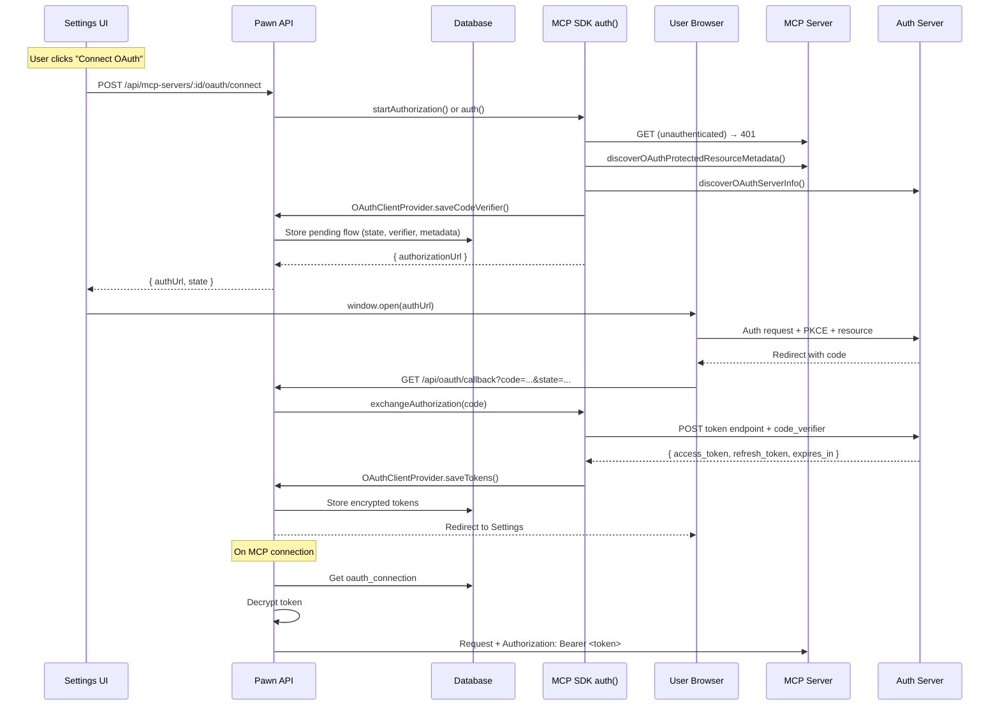

# feat: Add MCP Client OAuth 2.1 Support

## Overview

Add first-class OAuth 2.1 authorization support for HTTP-based MCP servers, compliant with the MCP Authorization specification. Leverage the MCP SDK's built-in OAuth client (`@modelcontextprotocol/sdk/client/auth.js`) for discovery, PKCE, and token exchange — implementing the SDK's `OAuthClientProvider` interface with database-backed encrypted token storage. When a user connects an MCP server that requires authentication, Pawn handles the full lifecycle: discovery, authorization, token exchange, encrypted storage, automatic refresh, and Bearer token injection.

## Problem Frame

MCP servers requiring OAuth authentication cannot be used without manually obtaining tokens out-of-band, storing them as static headers, and manually refreshing when they expire. This is friction-heavy compared to modern data connector experiences. The MCP spec defines a standard authorization flow based on OAuth 2.1, and Pawn should implement it as a first-class client.

## Requirements Trace

- R1. Support the MCP Authorization spec flow: 401 → Protected Resource Metadata discovery → Auth Server discovery → OAuth 2.1 authorization code flow with PKCE → Bearer token injection
- R2. Encrypt OAuth tokens (access + refresh) at rest using AES-256-GCM
- R3. Automatically refresh tokens before expiration via background polling
- R4. Provide UI for initiating OAuth connections, viewing status, and disconnecting
- R5. Support user-provided client credentials (client ID/secret per MCP server)
- R6. System-wide connections (one OAuth connection per MCP server, not per-user)
- R7. Implement Resource Indicators (RFC 8707) — include `resource` parameter in auth/token requests
- R8. Support step-up authorization (handle 403 insufficient_scope by re-authorizing with expanded scopes)
- R9. Support authorization server discovery via both RFC 8414 and OpenID Connect Discovery
- R10. Handle token revocation and graceful degradation when tokens expire or are revoked

## Scope Boundaries

- OAuth 2.1 only — no OAuth 1.0a support
- HTTP-based transports only (sse, streamable-http) — stdio uses environment credentials per MCP spec
- System-wide connections only — per-user scoping deferred
- No Dynamic Client Registration in initial release — users provide client credentials
- No SAML/OIDC enterprise SSO
- No multi-workspace support (e.g., multiple Slack workspaces per server)

## Context & Research

### Relevant Code and Patterns

- `packages/db/src/schema/mcp-servers.ts` — existing MCP server table, Drizzle ORM pattern
- `server/src/routes/mcp-servers.ts` — Express router with standard CRUD + test/tools endpoints
- `server/src/services/mcp-client.ts` — `McpClientPool` with `buildTransport()` that constructs HTTP transports with headers; `SSEClientTransport` and `StreamableHTTPClientTransport` already accept an `authProvider` option
- `@modelcontextprotocol/sdk` v1.29.0 — ships complete OAuth client: `OAuthClientProvider` interface, `auth()` orchestrator, `startAuthorization()`, `exchangeAuthorization()`, `refreshAuthorization()`, `discoverOAuthProtectedResourceMetadata()`, `discoverOAuthServerInfo()`
- `packages/shared/src/index.ts` — `ApiMcpServer` interface, shared types
- `ui/src/pages/Settings.tsx` — MCP server management UI with `McpServerRow` component
- `ui/src/lib/api.ts` — API client with `ApiError` class and standard fetch patterns
- `packages/db/src/migrations/` — Drizzle Kit SQL migrations (currently at 0016)

### Institutional Learnings

- **Config resolution chain**: Follow `DATA_DIR` + file convention for encryption key (see `database.json`, `providers.json` patterns)
- **Fail-fast on invalid security config**: If encryption key file exists but is malformed, exit immediately — never fall through to insecure defaults
- **Mask secrets at API boundary**: Use single masking point before any response leaves the server (see `maskSensitiveSetting()` pattern)
- **Route handlers own the logic**: MCP tools delegate to HTTP routes, not direct DB access. OAuth flow logic belongs in route handlers/service layer, not reimplemented per consumer

### External References

- MCP Authorization Specification: https://spec.modelcontextprotocol.io/specification/draft/basic/authorization/
- OAuth 2.1 Draft: https://datatracker.ietf.org/doc/html/draft-ietf-oauth-v2-1-13
- RFC 9728: OAuth 2.0 Protected Resource Metadata
- RFC 8414: OAuth 2.0 Authorization Server Metadata
- RFC 8707: Resource Indicators for OAuth 2.0

## Key Technical Decisions

- **Implement MCP SDK's `OAuthClientProvider` interface**: Rather than building discovery and PKCE from scratch, implement the SDK's `OAuthClientProvider` backed by database storage. The SDK's `auth()` orchestrator and HTTP transports' `authProvider` option handle the protocol flow. Our implementation provides `tokens()`, `saveTokens()`, `clientInformation()`, `saveClientInformation()`, `saveCodeVerifier()`, `codeVerifier()`, and `redirectToAuthorization()`.
- **Server-mediated redirect flow**: Since the OAuth flow is server-initiated (not browser SPA), `redirectToAuthorization()` returns the authorization URL to the frontend rather than performing a redirect. Two-phase: (a) POST /connect returns the auth URL, (b) GET /callback handles the redirect.
- **AES-256-GCM for token encryption**: Key auto-generated and persisted to `DATA_DIR/oauth-encryption.key` (following established file-based config convention). `OAUTH_ENCRYPTION_KEY` env var overrides for production.
- **Polling-based token refresh**: `setInterval` at 60 seconds (following `startOllamaPolling` pattern). The SDK's `refreshAuthorization()` handles the actual refresh protocol.
- **OAuth state in database**: Pending flow state (PKCE verifier, scopes, metadata) stored in `oauth_pending_flows` table with 10-minute TTL.
- **Client credentials in `mcp_servers` table**: Extend with `oauth_config` JSONB column.

## Open Questions

### Resolved During Planning

- **OAuth version scope**: OAuth 2.1 per MCP spec — not 1.0a
- **Connection scoping**: System-wide. Multi-user deferred.
- **Client credential model**: User-provided. No pre-shipped provider configs.
- **PKCE**: Required, S256 method (handled by MCP SDK).
- **Discovery implementation**: Use MCP SDK's `discoverOAuthProtectedResourceMetadata()` and `discoverOAuthServerInfo()` rather than hand-rolling.

### Deferred to Implementation

- **Token encryption key rotation strategy**: Single key for v1. Rotation added later.
- **Retry behavior for failed token refresh**: Exact backoff tuned during implementation.
- **Whether to support Client ID Metadata Documents**: MCP spec recommends them but requires hosting an HTTPS endpoint. Pre-registration sufficient for v1.
- **Exact `OAuthClientProvider.redirectToAuthorization()` implementation**: The SDK expects this to perform a redirect, but our server-mediated flow needs to return the URL. May need to wrap `auth()` or use `startAuthorization()` directly.

## High-Level Technical Design

> *This illustrates the intended approach and is directional guidance for review, not implementation specification. The implementing agent should treat it as context, not code to reproduce.*

## Implementation Units

- [ ] **Unit 1: Token Encryption Service**

**Goal:** Create a reusable encryption service for storing OAuth tokens securely at rest.

**Requirements:** R2

**Dependencies:** None

**Files:**
- Create: `server/src/services/oauth-crypto.ts`
- Test: `server/src/services/__tests__/oauth-crypto.test.ts`

**Approach:**
- AES-256-GCM with random 12-byte IV per encryption
- Key sourced from `OAUTH_ENCRYPTION_KEY` env var (hex-encoded 32-byte key)
- If env var not set, auto-generate key and persist to `DATA_DIR/oauth-encryption.key` (following `database.json` pattern)
- If key file exists but is malformed, fail-fast with clear error (per institutional learning)
- Export `encrypt(plaintext: string): string` → `iv:ciphertext:authTag` (all base64)
- Export `decrypt(encrypted: string): string` → plaintext
- Export `ensureEncryptionKey(): string` for startup initialization — returns the key path for logging

**Patterns to follow:**
- `server/src/services/channel-manager.ts` for node:crypto usage
- `server/src/services/database-config.ts` for DATA_DIR file-based config pattern

**Test scenarios:**
- Happy path: encrypt then decrypt a token string returns the original
- Happy path: two encryptions of the same plaintext produce different ciphertexts (unique IV)
- Edge case: empty string encrypts and decrypts correctly
- Error path: decrypt with wrong key throws
- Error path: decrypt with corrupted ciphertext throws
- Error path: decrypt with malformed format (missing IV or auth tag) throws

**Verification:**
- Can round-trip encrypt/decrypt arbitrary strings
- Different IVs per call confirmed by test

---

- [ ] **Unit 2: Database Schema — OAuth Tables**

**Goal:** Add database tables for OAuth connections and pending flows, extend mcp_servers with OAuth config.

**Requirements:** R1, R2, R5, R6

**Dependencies:** Unit 1

**Files:**
- Modify: `packages/db/src/schema/mcp-servers.ts`
- Create: `packages/db/src/schema/oauth-connections.ts`
- Modify: `packages/db/src/schema/index.ts`
- Create: `packages/db/src/migrations/0017_add_oauth_support.sql`

**Approach:**
- New `oauth_connections` table: id (uuid PK), mcp_server_id (FK → mcp_servers, cascade delete, unique), access_token (text, encrypted), refresh_token (text, nullable, encrypted), expires_at (timestamptz), scope (text), token_type (text, default 'Bearer'), status ('active' | 'expired' | 'revoked' | 'error'), connected_at (timestamptz), last_refreshed_at (timestamptz, nullable), error_message (text, nullable), auth_server_url (text — needed for refresh), client_registration (jsonb, nullable — for SDK `clientInformation()`)
- New `oauth_pending_flows` table: id (uuid PK), mcp_server_id (FK), state (text, unique), code_verifier (text), redirect_uri (text), scopes (text), resource_uri (text), auth_server_metadata (jsonb), created_at (timestamptz), expires_at (timestamptz, default now+10min)
- Extend `mcp_servers` with `oauth_config` JSONB column: `{ clientId: string, clientSecret?: string, scopes?: string[] }`
- Unique constraint on `oauth_connections.mcp_server_id` enforces system-wide (one connection per server)

**Patterns to follow:**
- `packages/db/src/schema/mcp-servers.ts` for table definition style (uuid PK, timestamptz, JSONB typed)
- `packages/db/src/migrations/0015_rename_packages_to_blueprints.sql` for migration style

**Test expectation:** none — schema-only change verified by migration application

**Verification:**
- Migration applies cleanly to existing database
- Schema exports available from `@pawn/db`

---

- [ ] **Unit 3: Shared Types — OAuth API Types**

**Goal:** Add shared TypeScript interfaces for OAuth-related API payloads.

**Requirements:** R1, R4

**Dependencies:** Unit 2

**Files:**
- Modify: `packages/shared/src/index.ts`

**Approach:**
- Add `ApiOAuthConnection` interface: id, mcpServerId, status, scope, tokenType, connectedAt, lastRefreshedAt, expiresAt, errorMessage (no raw tokens exposed to frontend)
- Add `ApiOAuthConfig` interface: clientId, hasClientSecret (boolean, never expose raw secret), scopes
- Extend `ApiMcpServer` with optional `oauthConfig?: ApiOAuthConfig` and `oauthConnection?: ApiOAuthConnection`
- Add `ApiOAuthConnectResponse` interface: authUrl, state
- Add `ApiOAuthStatus` type union: 'active' | 'expired' | 'revoked' | 'error' | 'disconnected'

**Patterns to follow:**
- Existing `ApiMcpServer`, `ApiMcpTool` interface patterns in `packages/shared/src/index.ts`
- Masking pattern: `hasClientSecret: boolean` instead of exposing the value (per institutional learning)

**Test expectation:** none — type definitions only, verified by TypeScript compilation

**Verification:**
- Types compile without errors
- Types used by both server and UI packages

---

- [ ] **Unit 4: OAuthClientProvider Implementation (SDK Integration)**

**Goal:** Implement the MCP SDK's `OAuthClientProvider` interface backed by database storage and encryption.

**Requirements:** R1, R2, R5, R7, R9

**Dependencies:** Unit 1, Unit 2

**Files:**
- Create: `server/src/services/oauth-provider.ts`
- Test: `server/src/services/__tests__/oauth-provider.test.ts`

**Approach:**
- Implement `OAuthClientProvider` interface from `@modelcontextprotocol/sdk/client/auth.js`
- Constructor takes `db: Db`, `mcpServerId: string`, `redirectUri: string`
- `clientInformation()`: Read from `mcp_servers.oauth_config` (client_id, client_secret)
- `saveClientInformation()`: Update `oauth_connections.client_registration` JSONB
- `tokens()`: Read from `oauth_connections`, decrypt tokens, return SDK `OAuthTokens` format
- `saveTokens()`: Encrypt tokens via oauth-crypto, upsert into `oauth_connections`
- `codeVerifier()`: Read from `oauth_pending_flows` by server ID
- `saveCodeVerifier()`: Store in `oauth_pending_flows`
- `redirectToAuthorization(authorizationUrl)`: Store the URL in a class property (server-mediated flow — we capture the URL rather than redirecting). This is the key adaptation point.
- Also export a helper `getAuthorizationUrl(db, mcpServerId)` that uses the SDK's `startAuthorization()` to initiate discovery + PKCE and returns the authorization URL

**Patterns to follow:**
- MCP SDK's `OAuthClientProvider` interface contract
- `server/src/services/mcp-client.ts` for service patterns

**Test scenarios:**
- Happy path: `tokens()` returns decrypted tokens from DB when active connection exists
- Happy path: `saveTokens()` encrypts and stores tokens, creates connection with 'active' status
- Happy path: `clientInformation()` returns client ID/secret from server's oauth_config
- Happy path: `codeVerifier()` / `saveCodeVerifier()` round-trip through pending flows table
- Edge case: `tokens()` returns undefined when no connection exists
- Edge case: `saveTokens()` upserts (updates existing connection on re-auth)
- Error path: `clientInformation()` throws when oauth_config not set on server
- Integration: `redirectToAuthorization()` captures URL that can be retrieved

**Verification:**
- Provider satisfies the `OAuthClientProvider` interface contract
- Tokens are encrypted at rest (inspect DB values)

---

- [ ] **Unit 5: OAuth Flow Service & API Routes**

**Goal:** Implement the server-mediated OAuth flow endpoints: connect, callback, disconnect, status.

**Requirements:** R1, R4, R5, R6, R7, R8

**Dependencies:** Unit 4

**Files:**
- Create: `server/src/services/oauth-flow.ts`
- Create: `server/src/routes/oauth.ts`
- Modify: `server/src/routes/mcp-servers.ts`
- Modify: `server/src/index.ts`
- Test: `server/src/services/__tests__/oauth-flow.test.ts`

**Approach:**
- `oauth-flow.ts`:
  - `initiateOAuthFlow(db, mcpServerId)`: Create `PawnOAuthClientProvider`, call SDK's `startAuthorization()` or `auth()` which triggers discovery + PKCE generation + stores verifier via provider. Capture the authorization URL from provider. Store pending flow metadata. Return `{ authUrl, state }`.
  - `handleOAuthCallback(db, state, code)`: Look up pending flow by state, validate not expired. Create provider, call SDK's `exchangeAuthorization()` with the code — SDK handles token endpoint call and calls `saveTokens()`. Delete pending flow. Return success/error.
  - `disconnectOAuth(db, mcpServerId)`: Delete oauth_connection row.
- `oauth.ts`:
  - `GET /api/oauth/callback` — handles browser redirect, calls `handleOAuthCallback()`, redirects to `/settings?oauth=success` or `?oauth=error&message=...`
- Extend `mcp-servers.ts`:
  - `POST /api/mcp-servers/:id/oauth/connect` — calls `initiateOAuthFlow()`, returns `{ authUrl, state }`
  - `DELETE /api/mcp-servers/:id/oauth/disconnect` — calls `disconnectOAuth()`
  - `GET /api/mcp-servers/:id/oauth/status` — reads oauth_connection status
  - `PATCH /api/mcp-servers/:id` — extend to accept `oauthConfig` in body
  - Update `rowToApi()` to join oauth_connection and mask client secret
- Register oauth router in `server/src/index.ts`
- Redirect URI: `http://localhost:${PORT}/api/oauth/callback` (overridable via `OAUTH_REDIRECT_URI` env var)

**Patterns to follow:**
- `server/src/routes/mcp-servers.ts` for route structure, error handling
- `server/src/routes/webhooks.ts` for callback-style routes

**Test scenarios:**
- Happy path: POST /connect returns authUrl and state for configured MCP server
- Happy path: GET /callback with valid state and code redirects to Settings with success
- Happy path: DELETE /disconnect removes connection and returns 204
- Happy path: GET /status returns current connection status
- Happy path: PATCH updates oauthConfig (client_id, scopes)
- Error path: POST /connect for server without oauth_config returns 400
- Error path: GET /callback with invalid state returns error redirect
- Error path: GET /callback with expired pending flow returns error redirect
- Edge case: GET /status for server with no connection returns `{ status: 'disconnected' }`
- Edge case: rowToApi includes oauthConnection status but never exposes tokens

**Verification:**
- Full OAuth flow works end-to-end via API
- Callback redirects to UI with appropriate indicators

---

- [ ] **Unit 6: MCP Client OAuth Integration**

**Goal:** Pass the `OAuthClientProvider` to HTTP transports so the SDK handles Bearer token injection and refresh automatically.

**Requirements:** R1, R8

**Dependencies:** Unit 4

**Files:**
- Modify: `server/src/services/mcp-client.ts`
- Modify: `server/src/routes/mcp-servers.ts`

**Approach:**
- Modify `McpClientPool.connect()` to accept optional `db: Db` parameter
- In `buildTransport()`, when transport is sse or streamable-http and server has an active oauth_connection:
  - Create a `PawnOAuthClientProvider` instance
  - Pass it as `authProvider` to `SSEClientTransport` or `StreamableHTTPClientTransport` constructor (the SDK already supports this)
  - The SDK automatically includes Bearer tokens in requests and handles 401 retry with token refresh
- Modify test/tools endpoints in mcp-servers route to pass `db` to pool.connect()
- For pipeline execution: pass `db` through `ExecutionEngine` to `McpClientPool`
- Non-OAuth servers: no change — authProvider is undefined, existing behavior preserved

**Patterns to follow:**
- `server/src/services/mcp-client.ts` existing `resolveEnvRefs()` pattern

**Test scenarios:**
- Happy path: OAuth-enabled server gets `authProvider` passed to transport
- Happy path: non-OAuth server works unchanged (no authProvider)
- Happy path: SDK automatically includes Bearer token in requests via authProvider
- Edge case: static headers and OAuth auth coexist (headers field for non-auth headers, authProvider for Bearer)
- Error path: expired token with refresh token — SDK auto-refreshes via authProvider
- Error path: expired token without refresh token — SDK calls redirectToAuthorization
- Integration: full flow — connect to MCP server with valid OAuth connection, list tools

**Verification:**
- OAuth-enabled MCP servers receive Bearer token in requests
- Non-OAuth servers continue to work exactly as before

---

- [ ] **Unit 7: Background Token Refresh**

**Goal:** Proactively refresh OAuth tokens before they expire, rather than waiting for a connection attempt.

**Requirements:** R3, R10

**Dependencies:** Unit 1, Unit 2, Unit 4

**Files:**
- Create: `server/src/services/oauth-refresh.ts`
- Modify: `server/src/index.ts`
- Test: `server/src/services/__tests__/oauth-refresh.test.ts`

**Approach:**
- `startOAuthRefreshPolling(db)` / `stopOAuthRefreshPolling()` — setInterval at 60-second intervals
- Query oauth_connections where status='active' AND expires_at < now + 5 minutes AND refresh_token IS NOT NULL
- For each: decrypt refresh token, call SDK's `refreshAuthorization()` with auth server URL from connection, encrypt and save new tokens
- On success: update tokens, expires_at, last_refreshed_at, reset error state
- On failure: increment retry count (stored in metadata jsonb), mark as 'error' after 3 consecutive failures with error_message
- Emit WebSocket event (`ws.broadcast({ type: 'data-changed', entity: 'mcp-servers' })`) on status change so UI can update

**Patterns to follow:**
- `server/src/services/ollama-provider.ts` for `startOllamaPolling`/`stopOllamaPolling` interval pattern
- `server/src/index.ts` for startup/shutdown lifecycle

**Test scenarios:**
- Happy path: token expiring in 3 minutes gets refreshed successfully
- Happy path: refresh token rotation — new refresh token stored
- Edge case: token expiring in 10 minutes is not refreshed (outside 5-min window)
- Edge case: connection with no refresh token is skipped
- Error path: refresh fails — connection marked 'error' after 3 retries
- Error path: refresh endpoint unreachable — retried on next poll

**Verification:**
- Tokens refresh automatically before expiration
- Failed refreshes degrade gracefully with status tracking

---

- [ ] **Unit 8: Frontend OAuth UI**

**Goal:** Add OAuth connection management UI to the Settings page MCP server section.

**Requirements:** R4, R5

**Dependencies:** Unit 3, Unit 5

**Files:**
- Modify: `ui/src/pages/Settings.tsx`
- Create: `ui/src/components/OAuthConnectionCard.tsx`
- Modify: `ui/src/lib/api.ts`

**Approach:**
- Add API methods to `ui/src/lib/api.ts`:
  - `initiateOAuthConnect(serverId): Promise<ApiOAuthConnectResponse>`
  - `disconnectOAuth(serverId): Promise<void>`
  - `updateMcpServerOAuthConfig(serverId, config): Promise<ApiMcpServer>`
- New `OAuthConnectionCard` component:
  - **Disconnected**: "Configure OAuth" section with client ID, client secret, scopes fields → Save → "Connect" button
  - **Connecting**: Loading spinner during redirect
  - **Connected**: Green status badge (`bg-emerald-500/20 text-emerald-300`), scopes, last refreshed, Disconnect button
  - **Expired/Error**: Amber/red warning badge with error message, Reconnect button
- Integrate into `McpServerRow` expanded view — show OAuthConnectionCard for HTTP-based servers (not stdio)
- OAuth callback handling: on Settings page mount, check URL params for `?oauth=success` or `?oauth=error` → show toast → clean URL params
- Use React Query `useQuery` for oauth status (included in `ApiMcpServer` response)

**Patterns to follow:**
- `ui/src/pages/Settings.tsx` existing `McpServerRow` component structure and styling
- Design tokens: `pawn-gold-*`, `pawn-surface-*`, `bg-pawn-surface-900`, `rounded-card`
- `useMutation` + `invalidateQueries` pattern for mutations

**Test scenarios:**
- Happy path: clicking "Connect" opens OAuth URL in new window/tab
- Happy path: connected state shows green badge, scopes, and disconnect button
- Happy path: disconnect button removes connection and UI updates
- Edge case: OAuth section only appears for HTTP transports (not stdio)
- Edge case: expired connection shows warning with reconnect option
- Error path: OAuth callback error displays toast with error message

**Verification:**
- Full OAuth flow from UI: configure credentials → connect → authorize → see connected status
- Status updates reflect after React Query refetch

---

- [ ] **Unit 9: Startup Lifecycle & Cleanup**

**Goal:** Wire OAuth services into server startup/shutdown and add pending flow cleanup.

**Requirements:** R3, R10

**Dependencies:** Unit 1, Unit 7

**Files:**
- Modify: `server/src/index.ts`

**Approach:**
- Call `ensureEncryptionKey()` at startup before DB init — log key source (env var or file)
- Call `startOAuthRefreshPolling(db)` after DB is ready
- Call `stopOAuthRefreshPolling()` in shutdown handler
- Startup cleanup: delete from `oauth_pending_flows` where `expires_at < now`
- Register OAuth callback router: `app.use("/api", createOAuthRouter(db))`

**Patterns to follow:**
- `server/src/index.ts` existing `startOllamaPolling()`/`stopOllamaPolling()` lifecycle pattern

**Test expectation:** none — integration wiring verified by end-to-end testing

**Verification:**
- Server starts cleanly with OAuth services initialized
- Stale pending flows cleaned up automatically

## System-Wide Impact

- **Interaction graph:** The `authProvider` passed to SDK transports hooks into every MCP connection path — test/tools endpoints, pipeline execution engine, global agent. Any code path that connects to an MCP server automatically benefits.
- **Error propagation:** OAuth errors surface as connection errors. The SDK's `auth()` handles 401 retry internally. Unrecoverable errors (revoked token, no refresh token) propagate as transport failures to the caller. UI shows status via OAuthConnectionCard.
- **State lifecycle risks:** Pending OAuth flows that never complete need cleanup via TTL. Token refresh races serialized by in-process lock per connection ID. The SDK's own retry logic may attempt refresh simultaneously with our background poller — mitigate with optimistic locking on `last_refreshed_at`.
- **API surface parity:** `oauthConfig` and `oauthConnection` are additive optional fields on `ApiMcpServer`. No breaking changes. The `headers` field continues to work for non-OAuth auth (API keys).
- **Integration coverage:** Critical path: OAuth flow → encrypted storage → SDK authProvider → Bearer token in MCP request → successful tool call.
- **Unchanged invariants:** stdio servers, non-OAuth HTTP servers, the `headers` field, env var resolution — all unchanged.

## Risks & Dependencies

| Risk | Mitigation |
|------|------------|
| Encryption key loss (DATA_DIR wiped) means all OAuth connections must be re-established | Document clearly. Auto-generate key is a convenience — production users should set `OAUTH_ENCRYPTION_KEY` env var. |
| SDK's `OAuthClientProvider.redirectToAuthorization()` expects a browser redirect, not URL capture | Wrap or use `startAuthorization()` directly instead of `auth()`. Adapter pattern to capture URL. |
| MCP servers with non-standard OAuth implementations | SDK handles spec compliance. Users can fall back to manual `headers` for non-compliant servers. |
| Token refresh races between background poller and SDK's inline refresh | Optimistic locking on `last_refreshed_at`. Single-process assumption for v1. |
| OAuth callback URL must be browser-accessible | Default to localhost:PORT. Document `OAUTH_REDIRECT_URI` for remote deployments. |

## Sources & References

- **Issue:** i75Corridor/pawn#64
- **MCP Authorization Spec:** https://spec.modelcontextprotocol.io/specification/draft/basic/authorization/
- **MCP SDK OAuth client:** `@modelcontextprotocol/sdk/client/auth.js` (v1.29.0, already installed)
- Related issues: #62 (MCP env config), #63 (MCP HTTP custom headers)
- Institutional learnings: `docs/solutions/best-practices/database-config-file-based-override-2026-04-06.md`, `docs/solutions/best-practices/adding-agent-tools-dual-system-architecture-2026-04-04.md`
